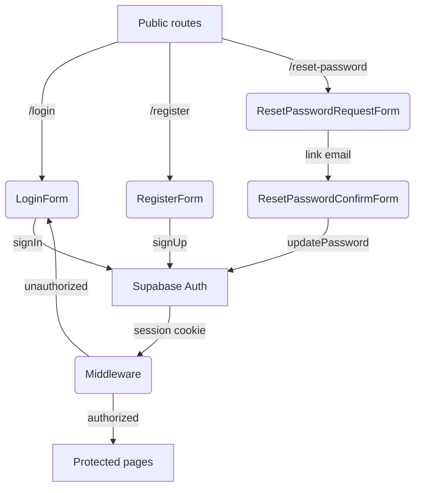

# Specyfikacja techniczna modułu autentykacji użytkowników

Autor: AI-Assistant
Data: {{DATE}}

---

## Spis treści
1. Wprowadzenie
2. Architektura interfejsu użytkownika
   2.1. Struktura stron Astro
   2.2. Komponenty React (client-side)
   2.3. Scenariusze użytkownika i walidacja
3. Logika backendowa
   3.1. Endpointy API
   3.2. Modele danych i typy
   3.3. Walidacja i obsługa błędów
   3.4. Zmiany w renderowaniu server-side
4. System autentykacji (Supabase Auth)
   4.1. Konfiguracja Supabase
   4.2. Przepływy: rejestracja, logowanie, wylogowanie, reset hasła
   4.3. Middleware i ochrona tras
5. Diagram przepływu (high-level)
6. Podsumowanie kluczowych decyzji

---

## 1. Wprowadzenie
Celem niniejszej specyfikacji jest opis architektury modułu rejestracji, logowania i odzyskiwania hasła w projekcie **10xCards**. Specyfikacja bazuje na wymaganiach **US-002** (Logowanie) oraz konsekwentnie wspiera **US-003/US-004** (Generowanie i przegląd fiszek) poprzez zapewnienie bezpiecznego dostępu do danych użytkownika. 

Technologie wykorzystywane w istniejącym projekcie to Astro 5, React 19, TypeScript 5, Tailwind 4, Shadcn/ui oraz Supabase. Założeniem jest nienaruszenie dotychczasowej struktury katalogów oraz istniejącej funkcjonalności generowania fiszek.

---

## 2. Architektura interfejsu użytkownika

### 2.1. Struktura stron Astro
| Ścieżka                   | Typ           | Dostępność             | Cel                                                                                     |
|---------------------------|---------------|------------------------|-----------------------------------------------------------------------------------------|
| `/login.astro`            | Public        | Non-Auth               | Formularz logowania (renderuje `<LoginForm />`).                                        |
| `/register.astro`         | Public        | Non-Auth               | Formularz rejestracji (renderuje `<RegisterForm />`).                                   |
| `/reset-password.astro`   | Public        | Non-Auth               | Formularz wysyłki linku resetującego (renderuje `<ResetPasswordRequestForm />`).        |
| `/reset-password/[token].astro` | Public | Non-Auth               | Formularz ustawienia nowego hasła (renderuje `<ResetPasswordConfirmForm />`).           |
| `/generate.astro`         | Protected     | Auth-Required          | Istniejąca strona generowania fiszek.                                                   |
| `/my-cards.astro`         | Protected     | Auth-Required          | (Planowane) lista zapisanych fiszek.                                                    |

Zmiany w layoucie:
* `src/layouts/Layout.astro` otrzymuje proste API `auth` (boolean + user metadata) przekazywane z *server-side* poprzez `Astro.locals`. Zależnie od `auth` renderowane jest menu nawigacyjne:
  * *Auth-mode*: linki do "Generuj", "Moje fiszki", avatar z dropdownem (Wyloguj).
  * *Non-auth-mode*: linki "Zaloguj" i "Rejestracja".

### 2.2. Komponenty React (client-side)
Nowe katalogi / pliki w `src/components`:
| Plik                                 | Odpowiedzialność                                                   |
|--------------------------------------|--------------------------------------------------------------------|
| `LoginForm.tsx`                      | Formularz logowania, lokalna walidacja, wywołanie `authService.login`. |
| `RegisterForm.tsx`                   | Rejestracja (email, password, confirm), lokalna walidacja.         |
| `ResetPasswordRequestForm.tsx`       | Przyjmowanie emaila, wysyłka linku resetującego.                   |
| `ResetPasswordConfirmForm.tsx`       | Przyjmowanie newPassword + confirmation, aktualizacja przez token. |
| `AuthProvider.tsx`                   | Kontekst React przechowujący stan `user`, `session`, util `signOut`.
| `ProtectedRoute.tsx` (optional)      | HOC dla elementów React-Router (w Astro eksportowanych islands).    |

Uzasadnienie podziału:
* **Astro pages** – odpowiadają za *routing* i integrację server-side (pobranie sesji z cookie, przekazanie do layoutu).
* **React components** – odpowiedzialne za interakcje, walidację w czasie rzeczywistym, call do Supabase (SDK JS). Dzięki podejściu "island architecture" kod JS ładowany jest tylko dla formularzy.

### 2.3. Scenariusze użytkownika i walidacja
| Scenariusz                         | Walidacja (client)                                  | Walidacja (backend)                             | Komunikat błędu                                  |
|------------------------------------|-----------------------------------------------------|-------------------------------------------------|--------------------------------------------------|
| Rejestracja                        | email format, min 8 znaków hasła, match confirm     | Duplikat email w DB, polityka hasła             | "Adres email już istnieje", "Hasło zbyt słabe"   |
| Logowanie                          | wymagane pola                                       | Nieprawidłowy email/hasło                       | "Nieprawidłowe dane logowania"                   |
| Reset link (request)               | email format                                        | brak użytkownika                                | "Nie znaleziono użytkownika o podanym adresie"   |
| Reset hasła (confirm)              | min 8 znaków, match confirm                         | token wygasł / niepoprawny                      | "Link wygasł lub jest niepoprawny"               |

Re-usable komponenty UI wykorzystywane z `src/components/ui` (Shadcn): `Input`, `Label`, `Button`, `Form`, `Alert`.

> **Zgodnie z US-001** po pomyślnej rejestracji użytkownik powinien zostać automatycznie zalogowany. W praktyce — wykorzystujemy konfigurację Supabase, w której `signUp` zwraca natychmiastową sesję (HTTP-only cookie) *oraz* wysyła mail weryfikacyjny. Dzięki temu spełniamy wymagania: konto jest od razu aktywne w aplikacji, a jednocześnie zachęcamy do potwierdzenia adresu poprzez mail.

---

## 3. Logika backendowa

### 3.1. Endpointy API
Ponieważ Supabase Auth udostępnia obsługę sesji po stronie klienta (HTTP only cookie), potrzebujemy wyłącznie cienkiej warstwy proxy dla operacji wymagających *server context* (np. wylogowanie przez usunięcie cookie) oraz pomocniczych HTTP 200/400 odpowiedzi dla formularzy SSR:

| Plik (`src/pages/api`)    | Metoda | Cel                                                       |
|---------------------------|--------|-----------------------------------------------------------|
| `auth/logout.ts`          | POST   | `supabase.auth.signOut()` + czyszczenie cookie            |
| `auth/user.ts`            | GET    | Zwraca `session.user` – używane przez *AuthProvider* (SW). |
| `account/delete.ts`       | POST   | Autoryzowane usunięcie konta + powiązanych rekordów (US-009). |
| ⬇ rozważane              |        | Inne akcje obsłuży klient bezpośrednio przez Supabase JS. |

> Rejestracja, logowanie i reset hasła wywoływane są wprost z klienta — brak dodatkowych endpointów.

### 3.2. Modele danych i typy
*Brak nowych tabel* w bazie – Supabase Auth zarządza własnymi tabelami `auth.users`. Dla integracji z istniejącymi tabelami `flashcards`, `generations` niezbędna jest kolumna `user_id UUID`.

W pliku `src/types.ts` uzupełniamy:
```ts
export type UserId = string; // UUID z Supabase
export interface Session {
  user: User;
  accessToken: string;
  expiresAt: number;
}
```

* **RLS (Row-Level Security)** – aby spełnić US-009 (izolacja danych), po włączeniu autentykacji należy **ponownie włączyć RLS** dla tabel `flashcards`, `generations` i dodać politykę `policy USING ( user_id = auth.uid() )`. Tymczasowo wyłączone w migracjach RLS zostanie przywrócone w kolejnej migracji wraz z politykami.

### 3.3. Walidacja i obsługa błędów
* Biblioteka `zod` (lub `valibot`) do walidacji schematów w React.
* Na backendzie korzystamy z Supabase JS i analizujemy `error` zwracany z metod Auth.
* Błędy mapowane na przyjazne komunikaty (tablica `AuthErrorMap`).

### 3.4. Zmiany w renderowaniu server-side
* `astro.config.mjs` pozostaje bez zmian – podpinamy `supabase` w czasie kompilacji nie ingerując w Vite.
* W `src/middleware/index.ts` dodajemy guard:
```ts
if (routeIsProtected && !locals.session) {
  return Response.redirect("/login", 302);
}
```
* Session odpowiednio wczytywana z `supabase.auth.getSession()` (SSR helper).

---

## 4. System autentykacji (Supabase Auth)

### 4.1. Konfiguracja Supabase
* Aktualizacja `src/db/supabase.client.ts` – dodanie `auth` helpers: `createBrowserClient()` + `createServerClient()`.
* Zmienna środowiskowa `SUPABASE_JWT_SECRET` dodana do `.env.example`.

### 4.2. Przepływy
1. **Rejestracja** (`signUp({ email, password })`)
   * Supabase zwraca `session` – użytkownik jest automatycznie zalogowany (spełnia US-001).
   * Dodatkowo wysyłany jest email weryfikacyjny (nie blokuje logowania).
   * Aplikacja wyświetla alert „Rejestracja udana – jesteś zalogowany. Sprawdź skrzynkę pocztową, aby potwierdzić adres”.
2. **Logowanie** (`signInWithPassword`)
   * Po sukcesie ustawiany jest HTTP-only cookie; redirect do `/generate`.
3. **Wylogowanie**
   * `POST /api/auth/logout` czyści cookie i redirectuje do `/login`.
4. **Reset hasła**
   * `supabase.auth.resetPasswordForEmail(email)` wysyła link z tokenem.
   * Strona `/reset-password/[token]` wykonuje `updateUser({ password })`.
5. **Usunięcie konta**
   * `POST /api/account/delete` – serwer, posiadając *service role key*, wykonuje `supabase.auth.admin.deleteUser(userId)` oraz kaskadowe usunięcie fiszek (`DELETE FROM flashcards WHERE user_id = :uid`).
   * Po sukcesie front przekierowuje do strony głównej z komunikatem o usunięciu konta.

### 4.3. Middleware & route protection
* `src/middleware/index.ts` sprawdza sesję dla tras w `PROTECTED_ROUTES = [/^\/generate/, /^\/my-cards/]`.
* Dodatkowo, trasy `/login`, `/register` przekierują do `/generate` jeśli użytkownik jest już zalogowany.

### 4.4. Bezpieczeństwo danych i RLS
* Polityki RLS wymuszają, że użytkownik może odczytać/zmodyfikować jedynie własne rekordy.
* Endpointy serwerowe stosują dodatkowe warunki `eq('user_id', uid)` dla ekstra bezpieczeństwa.

---

## 5. Diagram przepływu (high-level)


---

## 6. Podsumowanie kluczowych decyzji
1. **Minimalny backend** – korzystamy z natywnych funkcji Supabase Auth; implementujemy tylko logout + SSR helpers.
2. **Island architecture** – formularze w React minimalizują JS na stronie.
3. **Ochrona tras** – prosty guard w `middleware/index.ts` zapewnia spójny dostęp.
4. **Brak migracji DB** – wykorzystujemy istniejące tabele Supabase Auth.
5. **Walidacja dwuetapowa** – client (szybkość) + backend (niezawodność).

---

> Dokument ten stanowi formalny opis architektury. Wszelkie zmiany wymagają aktualizacji niniejszej specyfikacji. 