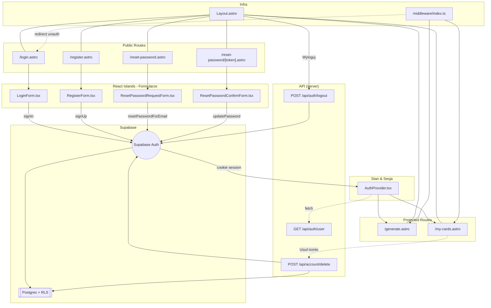

<architecture_analysis>

1. Komponenty zdefiniowane w specyfikacji oraz kodzie:
   • Strony Astro: `index.astro`, `generate.astro`, `login.astro`, `register.astro`, `reset-password.astro`, `reset-password/[token].astro`, `my-cards.astro`
   • Layout: `layouts/Layout.astro`
   • Middleware: `middleware/index.ts`
   • React (islands): `LoginForm.tsx`, `RegisterForm.tsx`, `ResetPasswordRequestForm.tsx`, `ResetPasswordConfirmForm.tsx`, `AuthProvider.tsx`, `ProtectedRoute.tsx`
   • Istniejące komponenty domenowe: `FlashcardGenerationView.tsx`, `FlashcardList.tsx`, `FlashcardListItem.tsx`, `GenerateButton.tsx`, `BulkSaveButton.tsx`, `ErrorNotification.tsx`
   • API (server): `api/auth/logout.ts`, `api/auth/user.ts`, `api/account/delete.ts`
   • Supabase warstwa: `db/supabase.client.ts` + tabele `auth.users`, `flashcards`, `generations` (z RLS)

2. Główne strony ↔ komponenty
   • `/login.astro` → `LoginForm` (React)
   • `/register.astro` → `RegisterForm`
   • `/reset-password.astro` → `ResetPasswordRequestForm`
   • `/reset-password/[token].astro` → `ResetPasswordConfirmForm`
   • `/generate.astro` → `FlashcardGenerationView`, `GenerateButton`, `ErrorNotification` (wymaga aktywnej sesji)
   • `/my-cards.astro` → `FlashcardList`, `BulkSaveButton`

3. Przepływ danych (happy-path):
   a. Użytkownik wchodzi na stronę publiczną → Layout ładuje się bez stanu auth.
   b. Formularz (React island) wywołuje Supabase Auth (`signIn`, `signUp`, `resetPasswordForEmail`, `updateUser`).
   c. Supabase ustawia HTTP-only cookie i zwraca `session`.
   d. `AuthProvider` (mount w Layout) pobiera `session` (fetch `/api/auth/user`) i udostępnia kontekst React.
   e. Middleware (`src/middleware/index.ts`) chroni trasy `/generate`, `/my-cards` – brak sesji ⇒ redirect `/login`.
   f. Zalogowany użytkownik korzysta z chronionych stron; przy wylogowaniu `Layout` wywołuje `/api/auth/logout` → Supabase `signOut()` → cookie cleared → redirect.
   g. Usunięcie konta (`POST /api/account/delete`) wywoływane z widoku "Profil" lub analogicznego (nieujęte w PRD, ale wymagane przez US-009).

4. Opisy komponentów (skrótowo)
   • LoginForm / RegisterForm – walidacja danych, obsługa błędów, integracja z Supabase Auth.
   • ResetPassword\* – przepływ "zapomniałem hasła".
   • AuthProvider – globalny kontekst użytkownika (React), exposes `signOut`.
   • ProtectedRoute – opcjonalny wrapper React (np. przyprowadzaniu dynamicznych widoków).
   • Layout.astro – wspólna nawigacja, reaguje na `auth` bool i dane użytk.
   • Middleware – SSR guard; centralny punkt egzekwowania ochrony zasobów.

</architecture_analysis>

<mermaid_diagram>

</mermaid_diagram>
